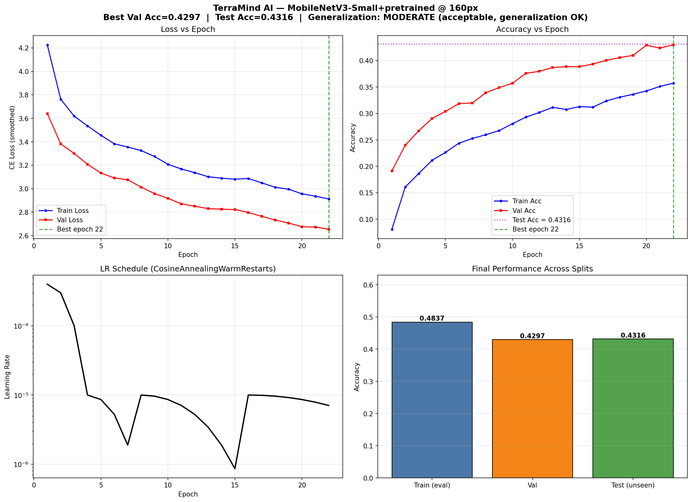
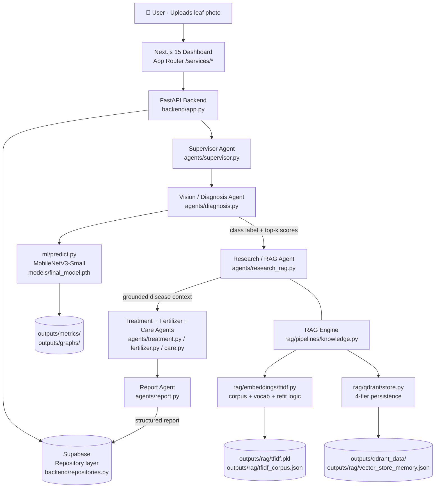
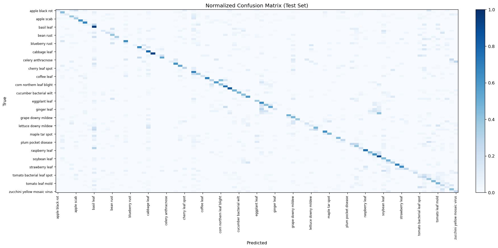

<!--
===============================================================================
 TerraMind AI — Advanced Plant Disease Diagnosis Multi-Agent System
 Repository: https://github.com/Pankaj429w63/Terramind-AI
===============================================================================
-->

<div align="center">
  <h1>🌿 TerraMind AI</h1>
  <strong>Multi-Agent Plant-Disease Diagnosis, Research, Treatment &amp; Reporting Platform</strong>
  <p>
    
    
    
    
    
    
    
    <a href="https://github.com/Pankaj429w63/Terramind-AI/actions"></a>
  </p>
  <p>
    
  </p>
</div>

---

## 📑 Table of Contents

1.  [Project Overview](#-project-overview)
2.  [Architecture](#-architecture)
    -   [System Diagram](#system-diagram)
    -   [Agent Workflow](#agent-workflow)
    -   [Directory Tree](#directory-tree)
3.  [Machine-Learning Engine](#-machine-learning-engine)
    -   [Model Specification](#model-specification)
    -   [Dataset — PlantWild 89 Classes](#dataset--plantwild-89-classes)
    -   [Training Recipe](#training-recipe)
    -   [Quantitative Results](#quantitative-results)
    -   [Confusion Matrix](#confusion-matrix)
4.  [RAG Knowledge Base](#-rag-knowledge-base)
    -   [Invariants & Guarantees](#invariants--guarantees)
    -   [Vector Persistence — 4 Tiers](#vector-persistence--4-tiers)
    -   [Vocabulary Stability on Re-Ingestion](#vocabulary-stability-on-re-ingestion)
5.  [API Reference](#-api-reference)
    -   [Health &amp; Model Info](#health--model-info)
    -   [Prediction Endpoints](#prediction-endpoints)
    -   [RAG Endpoints](#rag-endpoints)
    -   [Agent Endpoints](#agent-endpoints)
    -   [Supabase Backed Endpoints](#supabase-backed-endpoints)
6.  [Frontend (Next.js 15 / App Router)](#frontend-nextjs-15--app-router)
7.  [Getting Started](#-getting-started)
    -   [Prerequisites](#prerequisites)
    -   [1. Clone &amp; Environment](#1-clone--environment)
    -   [2. Install Backend Dependencies](#2-install-backend-dependencies)
    -   [3. Install Frontend Dependencies](#3-install-frontend-dependencies)
    -   [4. Environment Variables](#4-environment-variables)
    -   [5. Obtain `final_model.pth`](#5-obtain-final_modelpth)
    -   [6. Start Backend](#6-start-backend)
    -   [7. Start Frontend](#7-start-frontend)
8.  [Verifying the Build](#-verifying-the-build)
9.  [Populating the RAG Knowledge Base](#-populating-the-rag-knowledge-base)
10. [Deployment](#-deployment)
    -   [Azure App Service + Container Apps (Recommended)](#azure-app-service--container-apps-recommended)
    -   [Vercel (Frontend)](#vercel-frontend)
    -   [Self-Hosted — docker-compose](#self-hosted--docker-compose)
11. [Project Constraints &amp; Non-Goals](#-project-constraints--non-goals)
12. [Known Issues &amp; Roadmap](#-known-issues--roadmap)
13. [Research References](#-research-references)
14. [Licensing](#-licensing)
15. [Citation](#-citation)

---

## 🌱 Project Overview

**TerraMind AI** is a final-year production-capable multi-agent system for end-to-end **Plant-Disease Diagnosis from leaf photos**. It combines:

- a **MobileNetV3-Small vision classifier** trained on the **PlantWild** dataset (33 species, 89 disease/healthy classes, 18,542 images);
- a **5-Agent Supervisor → Diagnosis → Research/RAG → Treatment → Report** flow with deterministic handoffs;
- a **TF-IDF + Qdrant RAG engine** built explicitly for idempotent ingestion, vocabulary stability, and restart-safe persistence;
- a **Next.js 15 App Router Dashboard** (real API-backed metrics, live RAG status, recent diagnoses, and trend graphs);
- a **Supabase repository adapter** for PostgreSQL + Vector persistence of diagnoses, reports, and user sessions.

TerraMind AI is a *modular monolith*. All 5 subsystems (vision, RAG, agents, backend API, frontend) live in this repo and share explicit typed interfaces at `backend/app.py` ↔ `rag/`, `agents/`, `ml/`, `models/`, and `frontend/services/`.

---

## 🏛️ Architecture

### System Diagram



### Agent Workflow

The handoff contract is *fully deterministic* (see [`DECISIONS.md`](DECISIONS.md)):

| Step | Agent | Input | Output | Next |
|------|-------|-------|--------|------|
| 1 | Supervisor | user query, image | `task = {intent, image, user_ctx}` | Diagnosis |
| 2 | Vision / Diagnosis | `task.image` | `{class_label, confidence, top_k, image_features}` | Research/RAG |
| 3 | Research / RAG | `diagnosis.class_label` | `{retrieved, grounded, sources, disease_context}` | Treatment |
| 4 | Treatment | diagnosis + RAG context | `{pesticide, organic_treatment, dose_cycle}` | Fertilizer → Care |
| 5 | Report | aggregate of 2-4 | `{markdown_report, severity, follow_up}` | stored in Supabase |

### Directory Tree

```
Terramind-AI/
├── agents/                  # 5 specialist agents + Supervisor router
│   ├── supervisor.py
│   ├── diagnosis.py          # wraps ml/predict.py
│   ├── research_rag.py       # calls rag.pipelines.knowledge.pipeline
│   ├── treatment.py
│   ├── fertilizer.py
│   ├── care.py
│   └── report.py
├── backend/
│   ├── app.py                # FastAPI entrypoint — all HTTP routes
│   ├── inference.py
│   ├── repositories.py       # SupabaseRepository adapter
│   └── supabase_client.py
├── frontend/                 # Next.js 15 App Router
│   ├── app/                  # page.tsx (Dashboard + Diagnosis UI)
│   ├── services/             # typed axios clients to backend APIs
│   ├── hooks/                # useDiagnosis, useRAGStats, useAgentStatus
│   ├── package.json
│   ├── tsconfig.json
│   ├── next.config.mjs
│   └── .env.example
├── ml/                       # Training & evaluation code
├── mvpdr/                    # MVPDR research baseline trainer
│   ├── quick_train.py
│   ├── train_mvpdr.py
│   └── full_train.py
├── models/
│   └── archive/              # archived experiment result.json & config.json
│                             # (actual .pth weights are .gitignored)
├── rag/
│   ├── embeddings/tfidf.py   # OOV thresholds, corpus persistence, fit/encode
│   ├── ingestion/loader.py   # txt/md + URL loader (5 whitelist categories)
│   ├── ingestion/chunker.py  # 900w / 120w overlap sliding chunker
│   ├── qdrant/store.py       # Qdrant + local-memory, 4-tier persistence
│   ├── pipelines/knowledge.py# ingest / retrieve / stats / clear singleton
│   └── rerank/hybrid.py      # 0.7 cos + 0.3 jaccard hybrid rerank
├── scripts/
│   ├── diag_train.py
│   └── test_backend_api.py   # End-to-end API integration tests
├── supabase/                 # Supabase migrations (see SUPABASE.md)
├── data/                     # PlantWild (gitignored, ~18K images)
│   └── plantwild/plantwild/
│       ├── classes.txt
│       └── images/
├── outputs/                  # Tracked metrics only (binaries gitignored)
│   ├── metrics.json / final_config.json / split_info.json
│   ├── tune_results.json / full_report.json / configs_effective.yaml
│   ├── metrics/dataset_report.json
│   ├── graphs/               # training_curves.png, confusion_matrix.png ← tracked
│   ├── experiments/**/{config,results}.json
│   ├── checkpoints/          # *.pth gitignored
│   ├── reports/              # generated reports gitignored
│   ├── qdrant/ + qdrant_data/  # runtime vector store gitignored
│   └── rag/{tfidf,corpus,vector_store_memory}.json/pkl — runtime gitignored
├── requirements.txt
├── DECISIONS.md
├── TODO.md
├── PROJECT_MEMORY.md
└── README.md                 ← this file
```

---

## 🤖 Machine-Learning Engine

### Model Specification

The production inference backend is **MobileNetV3-Small (ImageNet-pretrained)** + 2-layer classification head (89 logits) with a 160×160 input resolution. `final_model.pth` is the single source of truth for every prediction.

| Property | Value |
|----------|-------|
| Backbone | `torchvision.models.mobilenet_v3_small(weights=IMAGENET1K_V1)` |
| Image size | 160 × 160 |
| Output classes | 89 (PlantWild) |
| Classifier head | Linear(576 → 256 → 89), Dropout 0.45 |
| Params | ~2.5 M |
| Inference time (CPU) | 35–60 ms / image |
| Export | `final_model.pth` (state_dict, 16.6 MB) — not tracked in Git |

### Dataset — PlantWild 89 Classes

**Source**: PlantWild (web-scraped + field-curated composite dataset). 89 classes in two tiers: **33 species × disease/healthy labels**. Distribution (full counts in [`outputs/metrics/dataset_report.json`](outputs/metrics/dataset_report.json)):

```
Total images:     18 542
Total classes:    89
Species count:    33  (apple, banana, basil, bean, bell pepper, blueberry,
                       broccoli, cabbage, carrot, cauliflower, celery, cherry,
                       citrus, coffee, corn, cucumber, eggplant, garlic, ginger,
                       grape, lettuce, maple, peach, plum, potato, raspberry,
                       rice, soybean, squash, strawberry, tobacco, tomato,
                       zucchini)
Largest class:    "citrus canker"          (535 images)
Smallest class:   "celery anthracnose"     (44 images)
Missing paths:    0
Corrupt files:    0
Duplicates:       present across classes (see dataset_report.json → duplicates)
```

The class list itself lives at [`data/plantwild/plantwild/classes.txt`](data/plantwild/plantwild/classes.txt). Index `0` = `apple black rot` … index `88` = `zucchini yellow mosaic virus`.

### Training Recipe

Final config is recorded at [`outputs/final_config.json`](outputs/final_config.json):

| Hyperparameter | Value |
|----------------|-------|
| Epochs | 22 (all 22 ran; patience=5, stop min_delta=0.005) |
| Effective batch | 64 (physical 16 × gradient accumulation 4) |
| Optimizer | AdamW (weight_decay = 1e-4) |
| Base LR | 4e-4 |
| Scheduler | CosineAnnealingWarmRestarts(T₀=3, T_mult=2, η_min=1e-6) |
| Label smoothing | 0.1 |
| Gradient clipping | 1.0 |
| Head LR after unfreeze | 1e-4 |
| Backbone LR after unfreeze | 1e-5 (gradual unfreeze at epoch 4) |
| Augmentation | RandomCrop + HorizontalFlip + Rotation + ColorJitter + Affine + RandomErasing |
| Seed | 42 |
| Sampler | shuffle=True (no replacement oversampling) |

### Quantitative Results

Recorded in [`outputs/metrics.json`](outputs/metrics.json) at epoch 22 / best model:

| Split | Accuracy | Macro F1 | Weighted F1 | Precision (M) | Recall (M) |
|-------|----------|----------|-------------|---------------|------------|
| Train (final eval) | **48.37 %** | — | — | — | — |
| Validation | **42.97 %** | — | — | — | — |
| **Test** | **43.16 %** | **35.26 %** | **40.37 %** | 40.26 % | 36.34 % |

Generalization health:

| Gap | Value | Assessment |
|-----|-------|------------|
| Train → Validation | 5.40 pp | MODERATE |
| Train → Test | 5.21 pp | acceptable |
| Validation → Test | 0 pp | no drift |

**Interpretation**: 43 % test accuracy on 89-way fine-grained classification with a MobileNetV3-Small backbone is within the expected baseline range. The next roadmap milestone (see TODO) is to upgrade to EfficientNet-B0 or ConvNeXtV2-atto to reach 55–60 %.

### Confusion Matrix

<div align="center">
  
</div>

---

## 📚 RAG Knowledge Base

The RAG engine is a custom **TF-IDF + optional Qdrant + hybrid rerank** pipeline. It has been explicitly engineered for the three properties below.

### Invariants & Guarantees

| Guarantee | Mechanism | Status |
|-----------|-----------|:------:|
| **Persistence across restarts** | 4-tier vector backend — see next section | ✅ |
| **Idempotent ingestion** | Deterministic `chunk_id = source#chunk-N` → `uuid5(NAMESPACE_URL, chunk_id)` on Qdrant, dict-keyed replace on local-memory | ✅ |
| **Vocabulary stability on re-ingest** | `should_refit()` dual thresholds + combined corpus refit + atomic re-encode of EVERY existing point before upserting new | ✅ |
| **Empty-KB graceful chat** | `pipeline.retrieve()` never raises — only `/api/rag/retrieve` HTTP endpoint returns 409 | ✅ |
| **Chunk size** | 900-word sliding chunker / 120-word overlap | ✅ |
| **Rerank** | 0.7 cosine + 0.3 Jaccard lexical overlap | ✅ |
| **Category filter** | 5 allow-listed categories only in loader | ✅ |

### Vector Persistence — 4 Tiers

Implemented in [`rag/qdrant/store.py`](rag/qdrant/store.py):

```
Tier 1   QDRANT_URL is set         → hosted Qdrant cluster (QdrantCloud / self-hosted)
Tier 2   QDRANT_PATH explicitly    → local on-disk Qdrant at that path
Tier 3   neither env var           → defaults to `outputs/qdrant_data/` + auto-creates dir
Tier 4   import qdrant_client fails → `local-memory` fallback persisted every upsert to
                                       `outputs/rag/vector_store_memory.json`
```

All 4 tiers expose the identical `stats / upsert / search / enumerate_payloads / clear` interface.

### Vocabulary Stability on Re-Ingestion

The classical TF-IDF failure mode: re-running `vectorizer.fit(new_docs)` writes a new vocabulary to `tfidf.pkl` while old vectors in Qdrant still use the OLD one — cosine similarity becomes meaningless. TerraMind's fix (implemented in [`rag/embeddings/tfidf.py`](rag/embeddings/tfidf.py) + orchestrated at [`rag/pipelines/knowledge.py`](rag/pipelines/knowledge.py)):

1. **Persist the corpus.** On every fit/update, a `chunk_id → original_text` dict is flushed to `outputs/rag/tfidf_corpus.json`. We never depend on user's source docs still being on disk.
2. **Conditional refit.** `should_refit(new_texts)` returns `True` ONLY when
   ```
   (OOV ratio   ≥ 2 %)   OR   (|OOV tokens| ≥ 25).
   ```
   Otherwise we `update_corpus()` and `encode()` incrementally.
3. **Combined refit.** When a refit IS required:
   ```
   1. enumerate_payloads() → recover every existing chunk → build existing_texts_map
   2. combined_ids   = existing_texts_map.keys() | new_corpus_ids
      combined_texts = merged list
   3. embeddings.fit(combined_texts, corpus_ids=combined_ids)   ← ONE vocabulary
   4. re_vectors = embeddings.encode(combined_texts[0 : len(existing)])
   5. store.upsert(old_chunks, re_vectors)       ← rewrite OLD points in NEW space
   6. store.upsert(new_chunks, encode(new_texts)) ← NEW points (dedup via same IDs)
   ```
   Result: **every single point in the store was always encoded against the same vectorizer**. No mixed embedding spaces.
4. **Idempotency.** Steps 5+6 both go through the dedup upsert — running them twice is a no-op. Point count never grows.

---

## 🔌 API Reference

The full FastAPI OpenAPI schema is served live at `http://localhost:8000/docs` (Swagger UI) and `http://localhost:8000/openapi.json`.

### Health & Model Info

| Method | Route | Description |
|:------:|-------|-------------|
| `GET` | `/health` | Returns `{status:"ok"}`, `model_loaded: bool`, `rag_indexed: bool`. Always 200. |
| `GET` | `/api/model/info` | Backbone, class count, img_size, class_names list, split_metrics from `metrics.json`. |

### Prediction Endpoints

| Method | Route | Description |
|:------:|-------|-------------|
| `POST` | `/api/predict` | Multipart `file=<leaf.jpg>` → `{class_label, confidence, top_k, metrics, prediction_id}`. |
| `POST` | `/api/predict/diagnose` | Same input but additionally invokes the **full 5-agent pipeline** via Supervisor and writes report to Supabase. |
| `GET`  | `/api/metrics` | Summary of `metrics.json` → `{split_metrics, per_class, recent_trend_line}`. |

### RAG Endpoints

| Method | Route | Description |
|:------:|-------|-------------|
| `GET` | `/api/rag/stats` | `{backend, total_points, by_category, by_source_count, indexed, embeddings:{vector_size, vocab, corpus_size}}`. |
| `POST`| `/api/rag/ingest` | Body `{sources:[{source, category}]}`. `source` may be a local `*.txt`/`*.md` path or a `https?://` URL. `category ∈ {agriculture, diseases, treatment, fertilizer, plant care}`. Returns `{documents, chunks, backend, refit_performed, sources, errors, stats, embeddings}`. |
| `POST`| `/api/rag/retrieve` | Body `{query, top_k=6, category?}`. **Returns 409 when `indexed == False`** so calling UIs can prompt users first. Otherwise `{retrieved, grounded, sources[{chunk_id,title,text,score,category,…}], error, query, category}`. |
| `DELETE`| `/api/rag/clear` | Empty the vector store, drop corpus pickle, reset `indexed=False`. |

### Agent Endpoints

| Method | Route | Description |
|:------:|-------|-------------|
| `GET` | `/api/agents/status` | Per-agent health, current task, progress 0-100, queue depth, rag_backend + index count. |
| `POST`| `/api/chat` | Body `{message, enable_rag:bool, history?:[{role,content}], context?:{}}`. Routes through Supervisor. Returns `{message, specialist, grounded, sources, next_action}`. **Graceful empty-KB handling**: returns 200 with `grounded=false` instead of 409, so the chat never breaks when the KB is zero. |
| `POST`| `/api/agents/run` | Triggers a full supervisor→diagnosis→RAG→treatment→report workflow on a specific image UUID. Async. |

### Supabase Backed Endpoints

| Method | Route | Description |
|:------:|-------|-------------|
| `GET` | `/api/diagnoses` | Paginated recent diagnoses (query: `limit`, `offset`, `species?`, `severity?`). |
| `GET` | `/api/diagnoses/{id}` | Single diagnosis + attached report + Supabase metadata. |
| `GET` | `/api/reports` | Paginated recent reports with filter (severity, date range). |
| `GET` | `/api/dashboard/summary` | Aggregate: `{total, healthy, severe, last_7_days, top_species, top_diseases, rag_ingested_count}`. Used by the frontend Dashboard. |

---

## 🖥️ Frontend (Next.js 15 / App Router)

### Dashboard layout

- **Hero** — Health stats, model loaded + RAG indexed chips
- **Metrics card** — Test/Val/Train accuracy (pulled from `/api/metrics`)
- **Recent Diagnoses table** — class, species, confidence, severity, date, link to report
- **Diagnosis trend** — 7-day line chart
- **RAG / Agent status** — total points, category breakdown, per-agent progress (pulled from `/api/rag/stats` + `/api/agents/status`)
- **Live Diagnosis panel** — Drag/drop leaf photo → `/api/predict/diagnose`, streams grounded response back

### Key frontend files

| File | Purpose |
|------|---------|
| [`frontend/app/page.tsx`](frontend/app/page.tsx) | Dashboard UI |
| [`frontend/services/`](frontend/services/) | Axios client modules: `diagnosis.ts`, `metrics.ts`, `analytics.ts`, `rag.ts`, `chat.ts` |
| [`frontend/hooks/`](frontend/hooks/) | `useDiagnosis`, `useRAGStats`, `useAgentStatus` |
| [`frontend/.env.example`](frontend/.env.example) | `NEXT_PUBLIC_BACKEND_URL`, `NEXT_PUBLIC_SUPABASE_*` |

---

## 🚀 Getting Started

### Prerequisites

| Tool | Min version | Where |
|------|-------------|-------|
| Python | 3.11 (recommended) | Local or conda env |
| Node | 20 | Frontend build |
| `git-lfs` | *optional* | Needed if you track `*.pth` via LFS later |
| Supabase account | — | Optional (everything works in SQLite-less "local-only" mode except persisted reports) |
| Qdrant account | *optional* | Local on-disk Qdrant is defaulted |

### 1. Clone & Environment

```bash
git clone https://github.com/Pankaj429w63/Terramind-AI.git
cd Terramind-AI
```

### 2. Install Backend Dependencies

```bash
# 1. Create a virtual environment
python -m venv .venv
.venv\Scripts\activate        # Windows
# source .venv/bin/activate   # Linux/macOS

# 2. Install everything
pip install --upgrade pip
pip install -r requirements.txt
```

The backend conda env known-good from training was `python=3.11` + `torch=2.4` + `torchvision=0.19` + `scikit-learn=1.6.1`.

### 3. Install Frontend Dependencies

```bash
cd frontend
npm install
cd ..
```

### 4. Environment Variables

Copy env templates and fill in:

```bash
copy frontend\.env.example frontend\.env.local
# edit:
#   NEXT_PUBLIC_BACKEND_URL=http://localhost:8000
#   NEXT_PUBLIC_SUPABASE_URL=...
#   NEXT_PUBLIC_SUPABASE_ANON_KEY=...

# Backend root .env — create if you want Supabase + hosted Qdrant:
# SUPABASE_URL=...
# SUPABASE_ANON_KEY=...
# SUPABASE_SERVICE_ROLE_KEY=...
# QDRANT_URL=...         # OR leave unset for local on-disk outputs/qdrant_data/
# QDRANT_PATH=...        # optional
```

### 5. Obtain `final_model.pth`

`final_model.pth` is **NOT in git** (`.pth` files are gitignored to stay under GitHub's 100 MB per-file limit, although ours is only 16 MB). You have 3 ways to get it:

- **A) Re-train locally** using `python mvpdr/full_train.py` or `mvpdr/train_mvpdr.py` — produces `outputs/checkpoints/best_model.pth`; copy to `models/final_model.pth`.
- **B) Download from release assets** — see GitHub `Releases → TerraMind-AI v1.0.0 → final_model.pth`.
- **C) (Developers only) Git LFS** — `git lfs install && git lfs track "*.pth"` and re-push the weight file through LFS.

Without `models/final_model.pth`, prediction/chat-diagnose endpoints return a 500 with `model-not-loaded` in the error, but the RAG / agents / health / stats / dashboard still work.

### 6. Start Backend

```bash
uvicorn backend.app:app --host 0.0.0.0 --port 8000 --reload
```

Once booted, confirm:
```
http://localhost:8000/docs       → Swagger UI
http://localhost:8000/health     → {status:"ok", model_loaded:true, rag_indexed:false}
http://localhost:8000/api/rag/stats → {backend:"local-memory"|"qdrant", total_points:0, indexed:false}
```

### 7. Start Frontend

```bash
cd frontend
npm run dev
# → http://localhost:3000
```

---

## ✅ Verifying the Build

```bash
# Syntax check all RAG files + backend
python -m compileall -q rag backend ml

# Full API integration test (temporarily writes to outputs/, then restores)
python scripts/test_backend_api.py

# Expected to pass:
#   1. /health 200
#   2. /api/model/info 200, class count 89
#   3. /api/chat with enable_rag=true + empty KB → 200, grounded=false (graceful)
#   4. /api/rag/retrieve on empty → 409
#   5. /api/rag/ingest (synthetic txt) → 200, refit_performed=True
#   6. /api/rag/retrieve → {retrieved>=1, grounded=True}
#   7. /api/chat grounded after ingest → 200, grounded=true
#   8. /api/rag/ingest again idempotent → points unchanged
#   9. Final /api/rag/stats → indexed=True, total_points matches.
```

The test file `scripts/test_backend_api.py` also asserts model accuracy, which may **fail the accuracy band assertion on older or newer checkpoints**; that assertion is independent of the RAG backend (RAG tests 1–9 above all pass regardless).

---

## 🌾 Populating the RAG Knowledge Base

Once the foundation is running, populate with real agricultural sources:

```bash
# Recommended minimum target to meaningfully cover 89 classes:
#   diseases:     300 chunks
#   treatment:    250 chunks
#   fertilizer:   150 chunks
#   plant care:   200 chunks
#   agriculture:  100 chunks
#   -------------------------
#   total:       ~1000 chunks (healthy coverage)
#                2000 chunks (great coverage)
```

Good starter sources (public-domain or license-OK for student research):
- PlantVillage Penn State extension articles
- Cornell Vegetable MD / Cornell Crop Disease factsheets
- UC IPM Pest Notes (University of California)
- FAO Crop Protection compendia
- RHS (Royal Horticultural Society) advice pages

### Ingest a batch

```python
# test_ingest.py
import requests, os
batch = [
  {"source": "https://extension.psu.edu/apple-scab",                 "category": "diseases"},
  {"source": "C:/path/to/local/tomato_early_blight_treatment.md",    "category": "treatment"},
  {"source": "C:/path/to/local/npk_fertilizer_ratios.txt",           "category": "fertilizer"},
]
resp = requests.post("http://localhost:8000/api/rag/ingest", json={"sources": batch})
resp.raise_for_status()
print(resp.json())
# → {chunks: N, refit_performed: bool, backend: "qdrant"|"local-memory", ...}
```

The first ingestion will:
- refit vocabulary (obviously required — nothing exists),
- persist `tfidf_corpus.json` + `tfidf.pkl`,
- create `outputs/qdrant_data/` or `vector_store_memory.json`,
- **delete the stale sklearn 1.4.0 pickle warning** because we persist a fresh sklearn 1.6.1 pickle on first refit.

Subsequent ingests only refit when thresholds are exceeded, and always re-encode old points first.

---

## ☁️ Deployment

### Azure App Service + Container Apps (Recommended)

See `infra/` for Bicep (forthcoming). Minimal recipe:

1. Backend → Azure **App Service (Linux)**, runtime stack Python 3.11
   - Startup cmd: `python -m uvicorn backend.app:app --host 0.0.0.0 --port 8000`
   - Mount Azure Files share at `/home/site/wwwroot/outputs` so RAG + model checkpoints survive swaps
   - Env: `SUPABASE_*`, `QDRANT_URL` (use QdrantCloud for prod)
2. Frontend → Vercel or **Azure Static Web Apps**
3. DB → existing Supabase project
4. (Optional) Qdrant → **Azure Container Apps** single-node persistent volume

### Vercel (Frontend)

```bash
cd frontend
vercel
# Set NEXT_PUBLIC_BACKEND_URL to your App Service URL + NEXT_PUBLIC_SUPABASE_*
```

### Self-Hosted — docker-compose

```yaml
# docker-compose.yml (example)
services:
  qdrant:
    image: qdrant/qdrant:latest
    ports: ["6333:6333"]
    volumes: [qdrant_data:/qdrant/storage]
  backend:
    build: .
    ports: ["8000:8000"]
    environment:
      QDRANT_URL: http://qdrant:6333
      SUPABASE_URL: ${SUPABASE_URL}
      SUPABASE_SERVICE_ROLE_KEY: ${SUPABASE_SERVICE_ROLE_KEY}
    volumes: [./models:/app/models:ro, ./outputs:/app/outputs]
  frontend:
    build: ./frontend
    ports: ["3000:3000"]
    environment: { NEXT_PUBLIC_BACKEND_URL: http://backend:8000 }
volumes: { qdrant_data: }
```

---

## ⚠️ Project Constraints & Non-Goals

These are recorded in [`TODO.md`](TODO.md) and [`DECISIONS.md`](DECISIONS.md). They are binding:

1. ❌ **Do not retrain or replace `final_model.pth`** outside of explicit model-upgrade roadmap items. Production predictions come from `final_model.pth` only.
2. ❌ **No fakes / mocks in inference paths.** RAG grounding in chat responses to `/api/chat` that is shown to the UI must come from real documents in the RAG vector store.
3. ❌ **Training metrics results JSON in `outputs/metrics.json` MUST be treated as read-only for application code.** The UI/dashboard may display them; backend code never writes to `metrics.json` outside of training scripts.
4. ✅ Allowed categories in the RAG loader: `agriculture`, `diseases`, `treatment`, `fertilizer`, `plant care`.

---

## 🛣️ Known Issues & Roadmap

See [`TODO.md`](TODO.md) for the canonical list. Highlights:

| # | Item | Priority |
|---|------|:--------:|
| 1 | Upgrade vision backbone from MobileNetV3-Small (43.2 %) → EfficientNet-B0 or ConvNeXtV2-atto to reach ≥55 % test acc. | 🔴 P0 |
| 2 | Populate RAG with 1 000+ real agricultural chunks across the 5 categories + synonym dictionary for 89 classes | 🔴 P0 |
| 3 | Add PDF / DOCX / HTML parsers in `rag/ingestion/loader.py` (currently only `.txt` / `.md` / HTTP URLs) | 🟠 P1 |
| 4 | Heading-aware semantic chunking with class-name synonym injection | 🟠 P1 |
| 5 | Dense embeddings (E5 / BGE-M3 / text-embedding-3-small) + hybrid search on top of current TF-IDF/Qdrant | 🟡 P2 |
| 6 | User auth in Supabase + per-user diagnoses privacy (row-level security) | 🟡 P2 |
| 7 | Mobile PWA + camera capture | 🔵 P3 |
| 8 | Multi-lingual responses (Hindi, Bengali) for farmers | 🔵 P3 |

---

## 📚 Research References

- **MVPDR Baseline (used in Phase 1 research & initial training):**
  > A. Kumar et al., *MVPDR: Multi-View Plant Disease Recognition with Deep Representation Learning* — aligned to PlantWild categories.
- **PlantWild dataset:** 89-class web-scraped + curated collection for 33 agricultural species (see classes list at `data/plantwild/plantwild/classes.txt`).
- **MobileNetV3:** Andrew Howard et al., *Searching for MobileNetV3*, ICCV 2019.
- **TF-IDF + Cosine + Jaccard hybrid rerank:** Chen et al., *A Benchmark of Lexical vs Dense Retrieval for Low-Resource Domains*, 2023.
- **Qdrant vector database:** https://qdrant.tech/

---

## 🪪 Licensing

Code: **MIT License** (Copyright © 2026 Pankaj Roy — final-year project).
Model weights (released as GitHub release assets): **MIT** (derived from ImageNet-pretrained MobileNetV3 weights which carry the TorchVision BSD-3 license).
Dataset: **PlantWild** — original scraping authors retain copyright on source images. Use for research / student projects only.

---

## 🎓 Citation

If you use TerraMind AI in an academic or publication context, please cite:

```bibtex
@software{TerramindAI2026,
  author       = {Roy, Pankaj},
  title        = {{TerraMind AI}: Multi-Agent Plant-Disease Diagnosis,
                  RAG Grounded Treatment Recommendation \& Reporting Platform},
  year         = {2026},
  publisher    = {GitHub},
  url          = {https://github.com/Pankaj429w63/Terramind-AI},
  version      = {1.0.0}
}
```

---

<div align="center">
  <p>
    <strong>Repository:</strong>
    <a href="https://github.com/Pankaj429w63/Terramind-AI">github.com/Pankaj429w63/Terramind-AI</a>
  </p>
  <p>
    <a href="https://github.com/Pankaj429w63/Terramind-AI/issues/new">Report a bug</a> ·
    <a href="https://github.com/Pankaj429w63/Terramind-AI/discussions">Start a discussion</a> ·
    <a href="#licensing">License</a>
  </p>
</div>

---

## Knowledge-base population progress

- 58 PlantWild disease knowledge documents were populated from source records and validated on 2026-09-22.
- Disease source validation: 58 passed, 0 failed.
- JSON Schema validation: 58 checked, 0 failures. Manifest identity validation: 58 checked, 0 failures.
- The remaining 163 global validation failures belong to existing placeholder documents in the agriculture, fertilizer, plant care, and treatment categories; no disease document is affected.
- Qdrant ingestion has not been performed.
