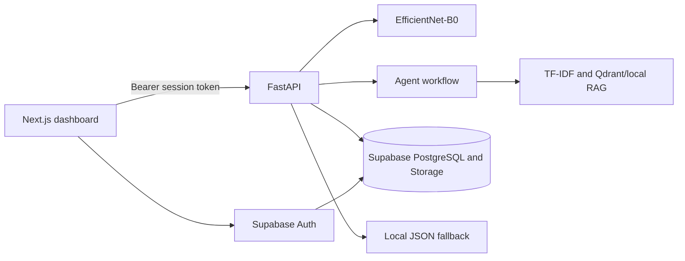

# TerraMind AI

TerraMind AI diagnoses plant diseases from images and combines the result with grounded agricultural guidance. The project includes an EfficientNet-B0 inference service, a FastAPI backend, a Next.js dashboard, a multi-agent workflow, a RAG knowledge base, optional Supabase persistence, and a human-review workflow.

## Features

- **Image diagnosis:** EfficientNet-B0, 224 px input, 89 PlantWild classes, top predictions and confidence scores.
- **Batch and agent workflows:** Analyze multiple images or run diagnosis, retrieval, treatment, fertilizer, care, and report agents.
- **Grounded guidance:** Search the agricultural knowledge base and return retrieved source passages.
- **Multimodal module:** Separate experimental image and class-metadata representation. It stays unavailable unless a validated checkpoint is installed; the production classifier remains the diagnosis source.
- **Accounts and private records:** Supabase email/password sign-in, user profiles, per-user diagnoses and reports, and RLS policies.
- **Expert review:** Low-confidence diagnoses can be reviewed with a decision, corrected class, notes, and timestamp. Reviews never update model weights.
- **Local fallback:** Diagnosis reports and review records are written locally when database persistence is unavailable.

## Architecture


```mermaid
flowchart LR
  UI[Next.js dashboard] -->|Bearer session token| API[FastAPI]
  API --> MODEL[EfficientNet-B0]
  API --> AGENTS[Agent workflow]
  AGENTS --> RAG[TF-IDF and Qdrant/local RAG]
  API --> DB[(Supabase PostgreSQL and Storage)]
  API --> LOCAL[Local JSON fallback]
  UI --> AUTH[Supabase Auth]
  AUTH --> DB
```

| Directory | Purpose |
|---|---|
| `backend/` | FastAPI routes, inference integration, Supabase client and repository |
| `frontend/` | Next.js App Router interface and API/auth services |
| `ml/` | Classifier serving and optional multimodal implementation |
| `agents/` | Diagnosis, research, treatment, fertilizer, care, and report workflow |
| `rag/` | Knowledge ingestion, retrieval, embeddings, reranking, and vector storage |
| `data/knowledge_base/` | Agricultural knowledge documents and validation schemas |
| `supabase/migrations/` | PostgreSQL schema, auth-linked profiles, and RLS policies |
| `scripts/` | Knowledge-base utilities and backend API checks |

## Requirements

- Python 3.11 or later
- Node.js 20 or later
- The EfficientNet-B0 checkpoint at `models/archive/2026-09-09_efficientnet_b0_official_v3/best_model.pth`
- Supabase is optional for local diagnosis; Supabase Auth and PostgreSQL are needed for authenticated per-user persistence.

Model checkpoints, uploaded images, local reports, runtime vector stores, and local environment files are excluded from Git. Obtain the checkpoint through the project’s authorized model distribution or training process before running inference.

## Setup

### Backend

```powershell
python -m venv .venv
.venv\Scripts\Activate.ps1
python -m pip install -r requirements.txt
Copy-Item .env.example .env.local
# Edit .env.local with the backend settings described below.
python -m uvicorn backend.app:app --reload --host 127.0.0.1 --port 8001
```

The API is available at `http://127.0.0.1:8001`; interactive docs are at `/docs`.

### Frontend

```powershell
cd frontend
npm install
Copy-Item .env.example .env.local
# Set the Supabase public URL/key if enabling sign-in.
npm run dev
```

The dashboard runs at `http://localhost:3000`.

## Environment configuration

The root `.env.example` documents backend variables:

| Variable | Purpose |
|---|---|
| `SUPABASE_URL` | Supabase project URL for the backend |
| `SUPABASE_SERVICE_ROLE_KEY` | Server-only database and storage access; keep secret and never use a `NEXT_PUBLIC_` name |
| `TERRAMIND_LOW_CONFIDENCE_THRESHOLD` | Default review threshold from `0.05` to `0.95` (default `0.35`) |
| `TERRAMIND_CORS_ORIGINS` | Comma-separated frontend origins |

The frontend `.env.example` uses only the public anon/publishable key:

| Variable | Purpose |
|---|---|
| `NEXT_PUBLIC_API_URL` | Backend base URL (default `http://127.0.0.1:8001`) |
| `NEXT_PUBLIC_SUPABASE_URL` | Supabase project URL |
| `NEXT_PUBLIC_SUPABASE_ANON_KEY` | Public anon/publishable key for browser authentication and RLS-protected reads |

Do not commit `.env.local` files or expose the service-role key in frontend configuration.

## Supabase setup

1. Configure the backend and frontend environment variables above.
2. Apply migrations in `supabase/migrations/` to the Supabase project (for example, with the Supabase CLI `supabase db push`).
3. Enable email/password authentication in Supabase Auth.
4. Run the backend and frontend. Account creation/sign-in uses Supabase Auth; API requests include the active access token.

The migrations create user profiles, diagnoses, predictions, reports, uploads, agent executions, chat events, and expert reviews. RLS policies scope user-owned rows and storage paths. Backend writes use the server-only service-role key only after validating the caller’s access token. If database persistence is unavailable, the backend keeps local JSON diagnosis/review records; personal history endpoints still require an authenticated identity.

## Diagnosis and expert review

Upload an image from **Plant Diagnosis**. The confidence threshold can be changed under **Settings** or configured with `TERRAMIND_LOW_CONFIDENCE_THRESHOLD`. Results below the active threshold show **Expert Review Recommended** and allow a reviewer to record:

- the model diagnosis and confidence;
- reviewer decision;
- corrected disease/class, when applicable;
- review notes and server timestamp.

Reviews are persisted separately from the classifier and are not training input. No expert outcome is generated automatically.

## API overview

| Method | Endpoint | Purpose / access |
|---|---|---|
| `GET` | `/health` | Backend and model health |
| `GET` | `/api/model/info`, `/api/model/labels` | Served model metadata and class labels |
| `POST` | `/api/diagnosis/predict` | Predict one image; saves a local report and associates it with the authenticated user when signed in |
| `POST` | `/api/diagnosis/batch` | Predict a batch of images |
| `POST` | `/api/agents/diagnose` | Run the multi-agent diagnosis workflow |
| `GET` | `/api/diagnosis/history`, `/api/diagnosis/history/database` | Authenticated user’s diagnosis history |
| `GET` | `/api/reports/database` | Authenticated user’s reports |
| `GET` | `/api/diagnosis/{id}` | Authenticated owner’s diagnosis details |
| `POST`, `GET` | `/api/reviews`, `/api/reviews/{diagnosis_id}` | Create/list reviews for an owned low-confidence diagnosis |
| `POST` | `/api/chat` | Grounded chat; diagnosis context requires authenticated ownership |
| `POST`, `GET` | `/api/rag/ingest`, `/api/rag/retrieve`, `/api/rag/stats` | Knowledge ingestion and retrieval |
| `GET` | `/api/analytics/summary`, `/api/analytics/graph/{name}` | Existing model analytics |

## Checks

```powershell
python -m compileall -q backend tests scripts/test_backend_api.py
python tests/test_auth_reviews.py
python scripts/test_backend_api.py
cd frontend
npm run build
```

The API test expects the model checkpoint and project knowledge-base artifacts to be available. Supabase connectivity and migrations must also be configured separately to verify live hosted persistence.

## License and dataset

See the repository’s license and dataset terms before redistribution. Plant image datasets and model checkpoints may have separate terms; they are not included in this repository by default.
