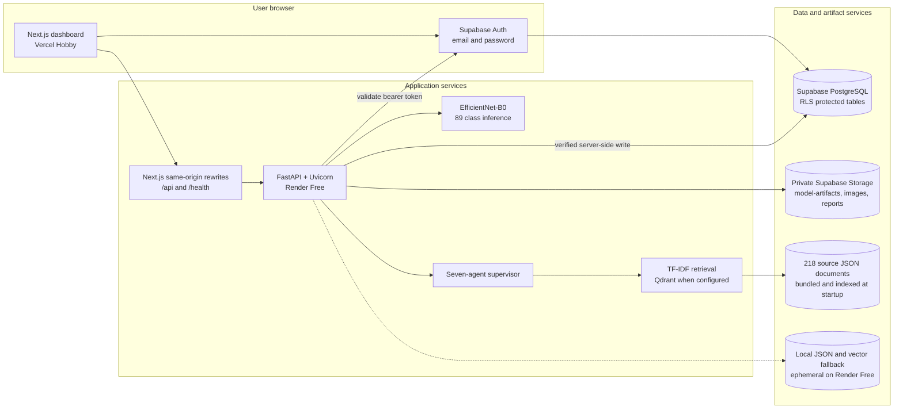
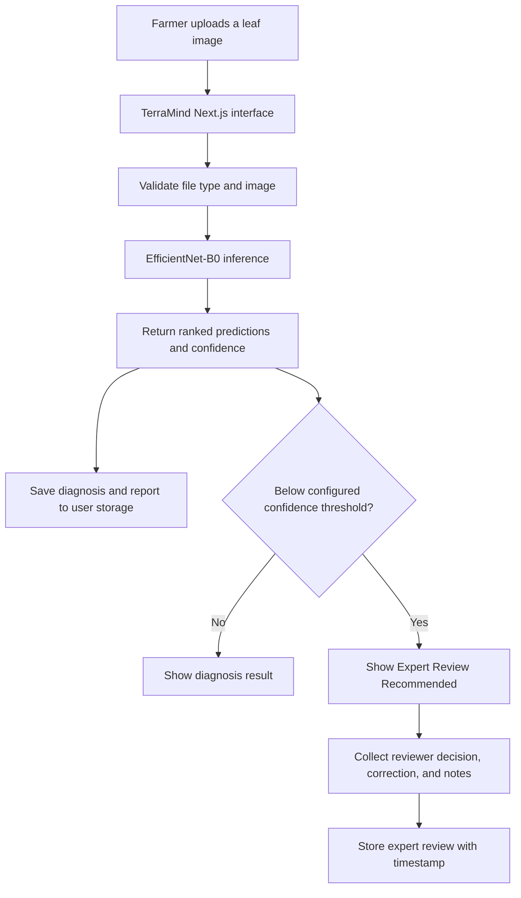
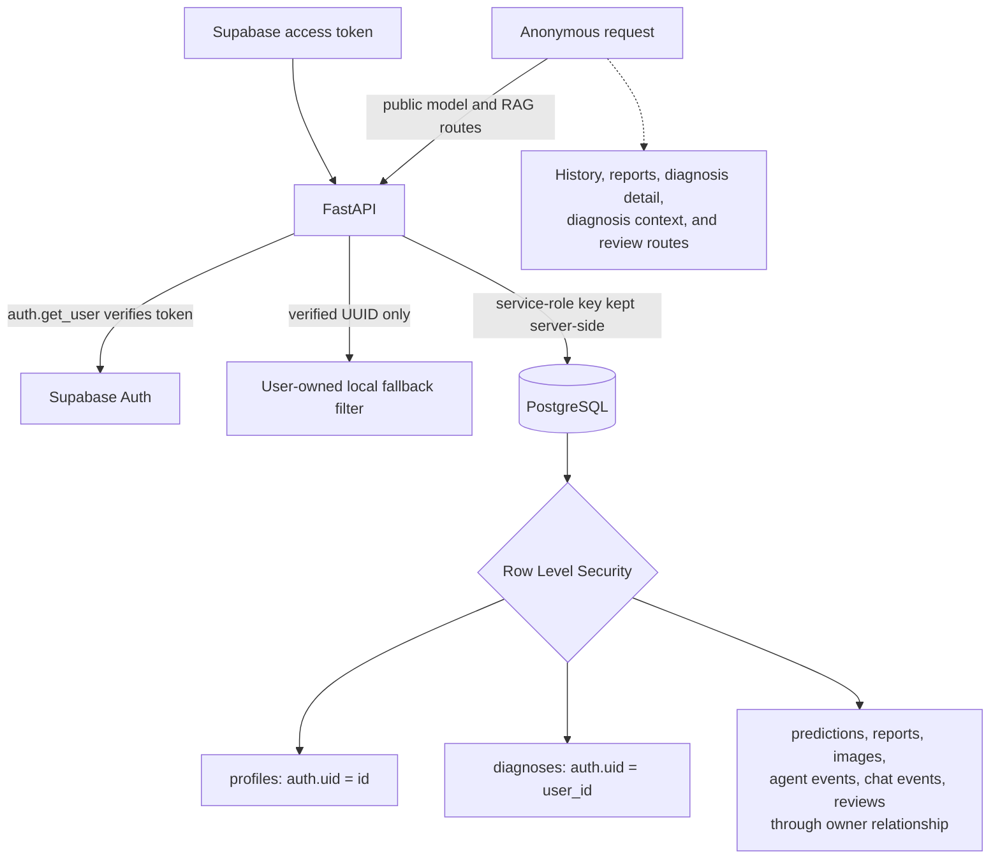
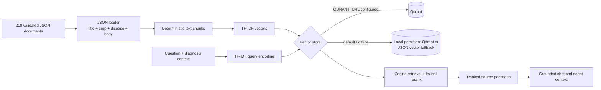
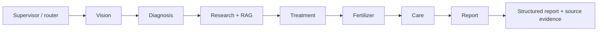
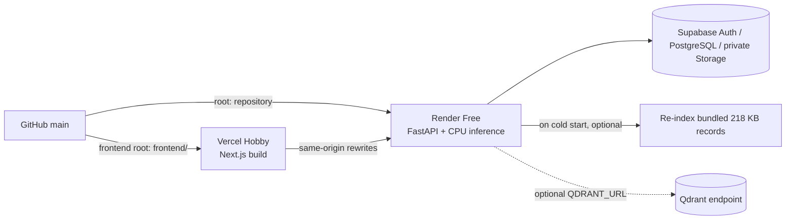

# TerraMind AI

<p align="center">
  
  
  
  
  
  
  <a href="https://vercel.com/pankaj429w63/terramind-ai-72q1"></a>
  
  
</p>

<p align="center">
  <a href="https://terramind-ai-72q1.vercel.app"><strong>Live Demo</strong></a>
  &nbsp; | &nbsp;
  <a href="http://localhost:3000">Local Frontend</a>
  &nbsp; | &nbsp;
  <a href="http://localhost:8001/docs">Local API Docs</a>
  &nbsp; | &nbsp;
  <a href="https://github.com/Pankaj429w63/Terramind-AI">GitHub Repository</a>
</p>

<p align="center">Plant disease recognition, grounded agricultural guidance, and expert review in one application.</p>

TerraMind AI is a plant-health diagnosis and agricultural guidance application. A Next.js dashboard calls a FastAPI service that serves the unchanged EfficientNet-B0 classifier, optionally routes work through seven workflow agents, retrieves evidence from an agricultural knowledge base, and records user-owned data and human reviews through Supabase when configured.

## Contents

- [System architecture](#system-architecture)
- [Technology and component map](#technology-and-component-map)
- [Verified model results](#verified-model-results)
- [RAG knowledge base](#rag-knowledge-base)
- [Seven-agent workflow](#seven-agent-workflow)
- [Multimodal architecture](#multimodal-architecture)
- [Authentication, privacy, and human review](#authentication-privacy-and-human-review)
- [Local development](#local-development)
- [Environment variables](#environment-variables)
- [Supabase setup](#supabase-setup)
- [Deployment](#deployment)
- [Validation](#validation)

## System architecture

### Runtime and deployment topology


```mermaid
flowchart LR
  subgraph Browser[User browser]
    UI[Next.js dashboard<br/>Vercel Hobby]
    AUTH[Supabase Auth<br/>email and password]
  end

  subgraph App[Application services]
    PROXY[Next.js same-origin rewrites<br/>/api and /health]
    API[FastAPI + Uvicorn<br/>Render Free]
    MODEL[EfficientNet-B0<br/>89 class inference]
    AGENTS[Seven-agent supervisor]
    RAG[TF-IDF retrieval<br/>Qdrant when configured]
  end

  subgraph Data[Data and artifact services]
    PG[(Supabase PostgreSQL<br/>RLS protected tables)]
    STORE[(Private Supabase Storage<br/>model-artifacts, images, reports)]
    KB[(218 source JSON documents<br/>bundled and indexed at startup)]
    LOCAL[(Local JSON and vector fallback<br/>ephemeral on Render Free)]
  end

  UI --> PROXY --> API
  UI --> AUTH --> PG
  API -->|validate bearer token| AUTH
  API -->|verified server-side write| PG
  API --> STORE
  API --> MODEL
  API --> AGENTS --> RAG
  RAG --> KB
  API -.-> LOCAL
```

In production the browser uses same-origin `/api/*` and `/health` routes. Next.js rewrites those requests to the Render API using the server-side `TERRAMIND_BACKEND_API_URL` setting. Local development can instead set `NEXT_PUBLIC_API_URL=http://127.0.0.1:8001`.

### Diagnosis and expert-review flow


```mermaid
flowchart TD
  FARMER[Farmer uploads a leaf image] --> UI[TerraMind Next.js interface]
  UI --> VALIDATE[Validate file type and image]
  VALIDATE --> INFER[EfficientNet-B0 inference]
  INFER --> RESULT[Return ranked predictions and confidence]
  RESULT --> SAVE[Save diagnosis and report to user storage]
  RESULT --> CONF{Below configured confidence threshold?}
  CONF -->|No| DONE[Show diagnosis result]
  CONF -->|Yes| NOTICE[Show Expert Review Recommended]
  NOTICE --> FORM[Collect reviewer decision, correction, and notes]
  FORM --> REVIEW[Store expert review with timestamp]
```

### Trust boundaries and data ownership


```mermaid
flowchart TB
  ANON[Anonymous request] -->|public model and RAG routes| API[FastAPI]
  TOKEN[Supabase access token] --> API
  API -->|auth.get_user verifies token| AUTH[Supabase Auth]
  API -->|verified UUID only| OWN[User-owned local fallback filter]
  API -->|service-role key kept server-side| PG[(PostgreSQL)]
  PG --> RLS{Row Level Security}
  RLS --> PROFILE[profiles: auth.uid = id]
  RLS --> DIAG[diagnoses: auth.uid = user_id]
  RLS --> CHILD[predictions, reports, images,<br/>agent events, chat events, reviews<br/>through owner relationship]
  ANON -.-> PRIVATE[History, reports, diagnosis detail,<br/>diagnosis context, and review routes]
```

The API does not treat a submitted `user_id` as identity. User-specific routes validate the bearer token and derive ownership from the Supabase Auth user. Service-role credentials are only read by backend code; browser code uses the public anon/publishable key and user RLS.

## Technology and component map

| Layer | Implementation | Main paths |
|---|---|---|
| Web app | Next.js 14, React 18, TypeScript | `frontend/app/`, `frontend/services/` |
| API | FastAPI, Pydantic, Uvicorn | `backend/app.py` |
| Production classifier | PyTorch, TorchVision EfficientNet-B0 | `ml/models/`, `ml/serving/` |
| Agent workflow | Vision/diagnosis, RAG research, treatment, fertilizer, care, report | `agents/workflow.py` |
| Retrieval | TF-IDF, lexical reranking, local vector fallback, optional Qdrant | `rag/` |
| Identity and data | Supabase Auth, PostgreSQL, Storage, RLS | `backend/repositories.py`, `supabase/migrations/` |
| Multimodal experiment | EfficientNet feature map + class-label token transformer + cross-attention | `ml/multimodal/` |
| Free-tier hosting | Vercel Hobby frontend; Render Free API; Supabase free project | `DEPLOYMENT.md`, `render.yaml` |

## Verified model results

These metrics were read from the currently served EfficientNet-B0 checkpoint and its companion result file and were asserted by the backend API validation script. They are checkpoint evaluation results, not a promise of field performance.

| Measure | Verified value |
|---|---:|
| Backbone | EfficientNet-B0 |
| PlantWild output classes | 89 |
| Input resolution | 224 × 224 |
| Test accuracy | **60.0218%** |
| Test macro F1 | **56.6969%** |
| Best validation macro F1 | **56.5659%** |
| Best epoch | **20** |

The checkpoint is intentionally not committed by default. Its file is not changed by this project’s auth, review, or deployment code. See [private checkpoint setup](DEPLOYMENT.md#model-checkpoint-on-render-free) for a checksum-verified Supabase Storage option for Render’s ephemeral filesystem.

## RAG knowledge base

The current local manifests define **218 JSON documents** across five categories: 58 disease, 58 treatment, 34 fertilizer, 34 plant care, and 34 agriculture records. The read-only source-validation workflow scanned all 218 records and reported **218 passed, 0 failed** in this workspace. The document contents were not changed for this deployment work.


```mermaid
flowchart LR
  DOCS[218 validated JSON documents] --> LOADER[JSON loader<br/>title + crop + disease + body]
  LOADER --> CHUNK[Deterministic text chunks]
  CHUNK --> TFIDF[TF-IDF vectors]
  TFIDF --> STORE{Vector store}
  STORE -->|QDRANT_URL configured| Q[(Qdrant)]
  STORE -->|default / offline| FILE[(Local persistent Qdrant or<br/>JSON vector fallback)]
  QUERY[Question + diagnosis context] --> ENCODE[TF-IDF query encoding]
  ENCODE --> STORE
  STORE --> RERANK[Cosine retrieval + lexical rerank]
  RERANK --> SOURCES[Ranked source passages]
  SOURCES --> CHAT[Grounded chat and agent context]
```

For Render Free, `TERRAMIND_RAG_AUTO_INGEST=true` indexes bundled documents at startup when the vector store is empty. Render’s filesystem is ephemeral, so that index is rebuilt after a service restart or spin-up. `QDRANT_URL` and `QDRANT_API_KEY` remain optional; no paid vector service is required by the local fallback architecture.

## Seven-agent workflow


```mermaid
flowchart LR
  SUP[Supervisor / router] --> V[Vision]
  V --> D[Diagnosis]
  D --> RR[Research + RAG]
  RR --> T[Treatment]
  T --> F[Fertilizer]
  F --> C[Care]
  C --> R[Report]
  R --> OUT[Structured report + source evidence]
```

The seven recorded execution steps are `vision`, `diagnosis`, `research_rag`, `treatment`, `fertilizer`, `care`, and `report`. Agent output is workflow guidance. Diagnosis class scores continue to come from the production EfficientNet-B0 model.

## Multimodal architecture

The multimodal pipeline combines an EfficientNet-B0 image feature map with a Transformer over class-label metadata tokens, a shared latent representation, bidirectional cross-attention, and image/text reconstruction heads. It is separate from the production 89-class EfficientNet-B0 classifier and does not modify that model.

## Authentication, privacy, and human review

- The UI supports Supabase email/password signup, sign-in, session persistence, and sign-out.
- The API validates Supabase bearer tokens for history, reports, diagnosis detail, diagnosis-context chat, and review routes.
- User IDs are taken from the validated auth session; submitted IDs are not trusted.
- PostgreSQL RLS scopes profiles, diagnoses, predictions, image/report records, agent/chat events, and reviews to their owner. Storage buckets for user files and model artifacts are private.
- Local diagnosis/report/review JSON is preserved when database operations fail. Local files on Render Free are temporary and should not be treated as durable storage.
- Diagnoses below `TERRAMIND_LOW_CONFIDENCE_THRESHOLD` (default `0.35`; UI setting can override for a request) display **Expert Review Recommended**.
- A review records diagnosis, confidence, reviewer decision, corrected class, notes, and timestamp. It does not alter or retrain model weights, and no expert outcome is fabricated.

## Local development

### Requirements

- Python 3.11 (recommended for deployment parity)
- Node.js 20+
- The existing EfficientNet-B0 checkpoint at `models/archive/2026-09-09_efficientnet_b0_official_v3/best_model.pth`, or a configured private Supabase Storage copy
- For the full API test, a local PlantWild sample image tree under `data/plantwild_v2/plantwild_v2/`

### Start the backend

```powershell
python -m venv .venv
.venv\Scripts\Activate.ps1
python -m pip install -r requirements.txt
Copy-Item .env.example .env.local
# Edit root .env.local. For local RAG bootstrap, set TERRAMIND_RAG_AUTO_INGEST=true.
python -m uvicorn backend.app:app --reload --host 127.0.0.1 --port 8001
```

API docs: <http://127.0.0.1:8001/docs> · health: <http://127.0.0.1:8001/health>.

### Start the frontend

```powershell
cd frontend
npm ci
Copy-Item .env.example .env.local
# Set the public Supabase URL/key if using authentication.
npm run dev
```

Dashboard: <http://localhost:3000>. For local development the frontend template points directly at `http://127.0.0.1:8001`.

## Environment variables

Keep these environments separate. Do not copy the backend service-role key into `frontend/.env.local` or any `NEXT_PUBLIC_*` variable.

### Backend (root `.env.local`, Render environment)

| Variable | Required | Meaning |
|---|---:|---|
| `SUPABASE_URL` | For auth/persistence | Supabase project endpoint |
| `SUPABASE_SERVICE_ROLE_KEY` | For server auth/DB/storage | Secret backend credential; never expose to browser |
| `TERRAMIND_MODEL_PATH` | No | Local path to unchanged `.pth` checkpoint |
| `TERRAMIND_MODEL_BUCKET` | For Render checkpoint restore | Private bucket, default `model-artifacts` |
| `TERRAMIND_MODEL_OBJECT` | For Render checkpoint restore | Object path, default `efficientnet-b0/best_model.pth` |
| `TERRAMIND_MODEL_SHA256` | For Render checkpoint restore | Expected 64-character SHA-256 |
| `TERRAMIND_RAG_AUTO_INGEST` | Render: `true` | Index bundled JSON records when the vector store is empty |
| `TERRAMIND_CORS_ORIGINS` | No | Explicit comma-separated frontend and local development origins |
| `TERRAMIND_LOW_CONFIDENCE_THRESHOLD` | No | Default threshold in `[0.05, 0.95]`; defaults to `0.35` |
| `QDRANT_URL`, `QDRANT_API_KEY` | No | Optional remote Qdrant endpoint and credential |
| `QDRANT_PATH` | No | Optional local Qdrant data path; ephemeral on Render Free |
| `TERRAMIND_MULTIMODAL_CHECKPOINT` | No | Experimental checkpoint path; unset means unavailable |

Root [.env.example](.env.example) contains backend variables only.

### Frontend (Vercel project, `frontend/.env.local` for local)

| Variable | Exposure | Meaning |
|---|---|---|
| `NEXT_PUBLIC_SUPABASE_URL` | Public | Supabase Auth endpoint |
| `NEXT_PUBLIC_SUPABASE_ANON_KEY` | Public | Anon/publishable browser key; RLS must remain enabled |
| `NEXT_PUBLIC_API_URL` | Public, local only | Direct local API override; clear this on Vercel |
| `TERRAMIND_BACKEND_API_URL` | Server/build routing config | Render API origin used by same-origin Next.js rewrites |

See [frontend/.env.example](frontend/.env.example). `TERRAMIND_BACKEND_API_URL` is a URL, not a credential. Configure the service-role key only on Render.

## Supabase setup

Apply migrations in timestamp order:

1. `supabase/migrations/20260905130000_terramind_schema.sql`
2. `supabase/migrations/20260926120000_auth_reviews_and_events.sql`

With the Supabase CLI installed and authenticated:

```powershell
supabase login
supabase link --project-ref vrdrkxrowjumhikirkyd
supabase db push
```

The second migration also creates the private `model-artifacts` bucket. Enable email/password in Supabase Auth. Set `SUPABASE_URL` and `SUPABASE_SERVICE_ROLE_KEY` in Render, and `NEXT_PUBLIC_SUPABASE_URL` plus `NEXT_PUBLIC_SUPABASE_ANON_KEY` in Vercel. For local-only diagnosis the database can be absent; personal history still requires a validated identity.

## Deployment

The repository includes a Render Blueprint at [render.yaml](render.yaml), a pinned [`.python-version`](.python-version), and detailed setup/verification instructions in [DEPLOYMENT.md](DEPLOYMENT.md).


```mermaid
flowchart LR
  MAIN[GitHub main] -->|frontend root: frontend/| V[Vercel Hobby<br/>Next.js build]
  MAIN -->|root: repository| R[Render Free<br/>FastAPI + CPU inference]
  V -->|same-origin rewrites| R
  R --> S[(Supabase Auth / PostgreSQL / private Storage)]
  R -->|on cold start, optional| INDEX[Re-index bundled 218 KB records]
  R -. optional QDRANT_URL .-> Q[(Qdrant endpoint)]
```

**Free-tier operating limits:** Vercel Hobby and Render Free are suitable for a demonstration, not an availability guarantee. Render Free services spin down after inactivity and have ephemeral storage; inference can have cold-start delay, and locally persisted reports/vector indexes are not durable there. The checkpoint is restored from private Supabase Storage by the server on startup. See [Render Free service limits](https://render.com/docs/free) and [Vercel monorepo root-directory setup](https://vercel.com/docs/builds/configure-a-build#root-directory).

## Validation

Run from the repository root (the API test requires the model and sample image artifacts described above):

```powershell
python -m compileall -q backend tests scripts
python scripts/test_backend_api.py
python scripts/test_rag_json_loader.py
python -m unittest tests.test_multimodal
python tests/test_auth_reviews.py
python tests/test_model_artifacts.py
git diff --check
cd frontend
npm run build
```

The full backend API script checks inference, model metadata and metrics, graph routes, single/batch diagnosis, all seven agents, RAG/chat, multimodal status, and unauthenticated private-route guards. Unit tests cover local artifact selection/checksum enforcement and auth/review ownership.
